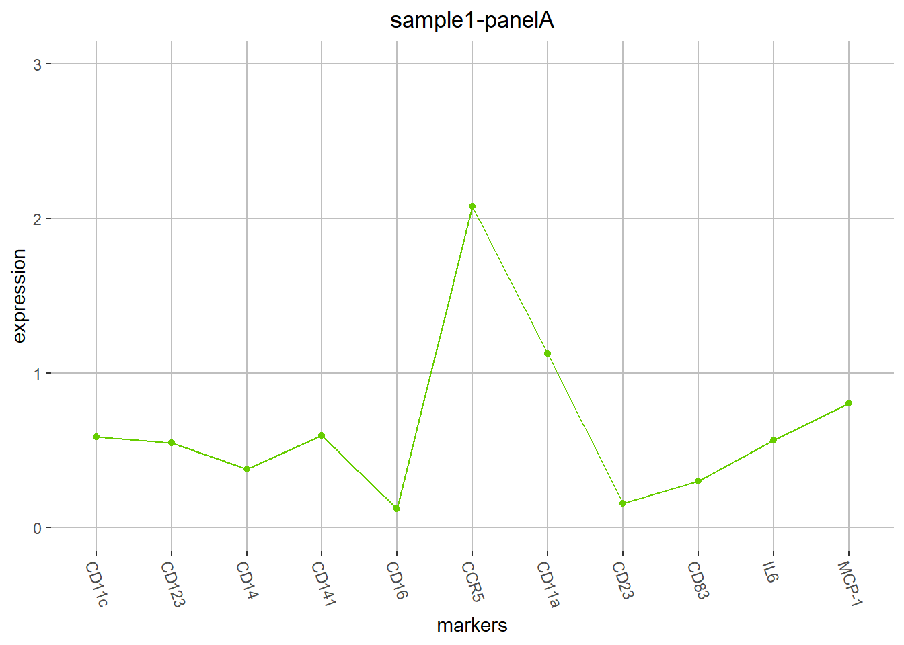
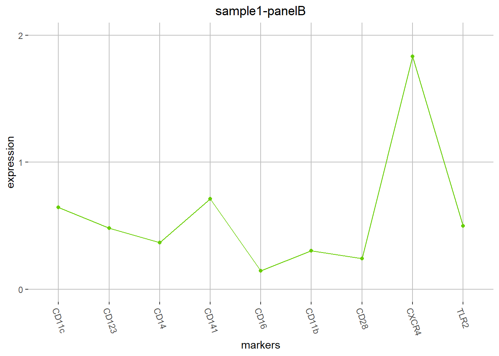
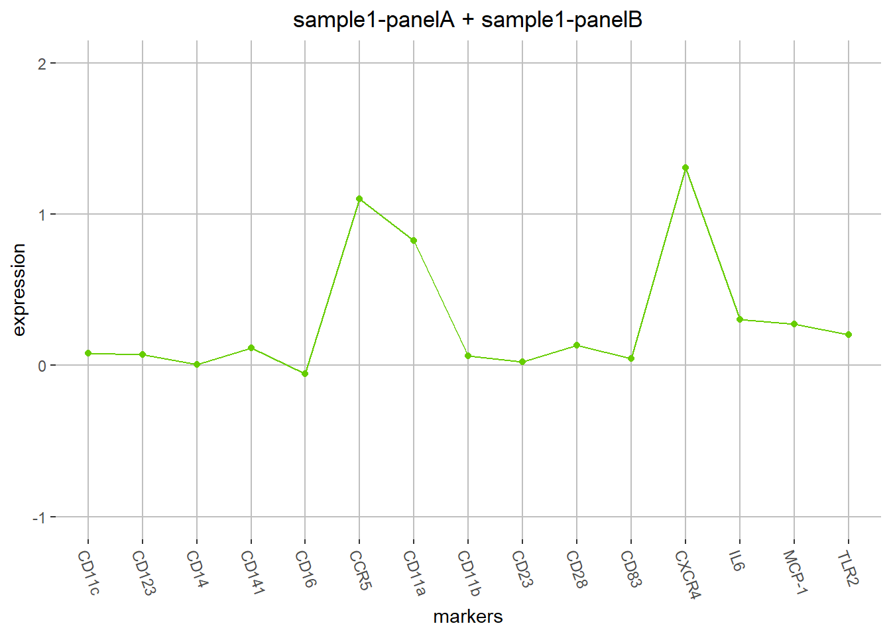

---  
title: 'CytoBackBone: an R package for merging of phenotype information from different cytometric profiles'
output:
  html_document:
    cache: no
    keep_md: yes
---

# CytoBackBone: an R package for merging of phenotype information from different cytometric profiles


# Table of Contents
1. [Package overview](#package_overview)
2. [Package installation](#package_installation)
3. [Import of cytometry profiles](#import)
4. [Merging of cytometry profiles](#merging)
5. [Extraction of left-out cells](#specific)

# <a name="package_overview"></a> 1. Package overview
Single-cell technologies are the most suitable techniques for the characterization of cells by the differential expression of the molecules that define their roles and functions in tissues. Among these techniques, mass cytometry represents a leap forward by increasing the number of available measurements to approximately 40 cell markers. Thanks to this technology, detailed immune responses were described in several diseases.However, the study of immune responses, such as that due to viral infections or auto-immune diseases, could be further improved by increasing the number of simultaneously measurable markers. To increase this number, we designed an algorithm, named CytoBackBone, which combines phenotypic information of different cytometric profiles obtained from different cytometry panels.

Thus, we designed an algorithm, named CytoBackBone, which allows combining phenotypic information of cells from different cytometric profiles obtained from different cytometry panels. This computational approach is based on the principle that each cell has its own phenotypic and functional characteristics that can be used as an identification card. CytoBackBone uses a set of predefined markers, that we call the backbone, to define this identification card. The phenotypic information of cells with similar identification cards in the different cytometric profiles is then merged. Our approach can extend the number of measurable markers without technical modification of mass or flow cytometers.

CytoBackBone uses a k Nearest Neighbor distances algorithm, based on k-d tree space partitioning, to identify cells that are acceptable and non-ambiguous nearest neighbors.

To be acceptable neighbors, the phenotypic distance between two cells must be lower than a specific threshold, defined by the user, which corresponds to a Euclidian distance computed as the square root of the sum of the squared expression differences for each pair of common markers.

To be defined as non-ambiguous nearest neighbors, two cells from two different profiles must be reciprocally the closest neighbors. First, the algorithm identifies the closest cells in cytometric profile #2 for each cell from cytometric profile #1. Then, the algorithm identifies the closest cells in cytometric profile #1 for each cell from cytometric profile #2. Merging is possible if two cells from different cytometric profiles are identified as mutual non-ambiguous nearest neighbors.

More precisely, the algorithm works as follows: (i) cells of each cytometric profile with no acceptable neighbors are first excluded from the two input profiles; (ii) all acceptable and non-ambiguous nearest neighbor cells remaining in the two profiles are merged into a new profile and are discarded from the two input profiles; (iii) the previous step of this procedure is repeated until no more acceptable and non-ambiguous neighbor cells can be found; and (iv) finally, all excluded and remaining cells are stored in supplementary cytometric profiles for information purposes. These successive iterations ensure that the algorithm finds a new set of acceptable and non-ambiguous neighbor cells at each step. The number of iteration performed by the algorithm varies depending on the dataset used, but usually ranges from 2 to 30 interactions.

A distance threshold defining acceptable nearest neighbors needs to be specified to avoid merging data between two cells that have very different levels for the backbone markers: the lower the threshold, the more accurate the merging. However, the threshold must not be too stringent as, by definition, cells cannot have exactly the same phenotype. On the contrary, merging can result in a significant loss of cells. Thus, the threshold must be carefully set to allow CytoBackBone to merge data from cells with similar levels of the backbone markers within a reasonable error range. The Euclidean distance between cells increases with the number of backbone markers. Therefore, the threshold value must be adjusted according to the length of this backbone.


# <a name="package_installation"></a> 2. Package installation
The `KNN` and `ggplot2` R packages as well as the `flowCore`, `flowUtils`, and `preprocessCore` Bioconductor packages are required for CytoBackBone. These packages can be installed using the following commands:

```r
install.packages('FNN')
install.packages('ggplot2')

source("http://bioconductor.org/biocLite.R")
biocLite(suppressUpdates=TRUE)
biocLite("flowCore",suppressUpdates=TRUE)
biocLite("flowUtils",suppressUpdates=TRUE)
biocLite("preprocessCore",suppressUpdates=TRUE)
```

CytoBackBone is available on [GitHub](https://github.com/), at https://github.com/tchitchek-lab/CytoBackBone. Its installation can be done via the `devtools` package using the following command:

```r
install.packages('devtools')
library("devtools")
install_github('tchitchek-lab/CytoBackBone')
```

Once installed, CytoBackBone can be loaded using the following command:

```r
library("CytoBackBone")
```


# <a name="import"></a> 3. Import of cytometry profiles
Cytometry profiles to merge can be imported as FCS files using the `import.FCS` function.
This function returns an object of class `FCS`


```r
FCS1         <- import.FCS("./sample1-panelA.fcs")
# select only some specific marker from the `FCS` object
FCS1         <- FCS1[,c("CD11c","CD123","CD14","CD141","CD16","CCR5","CD11a","CD23","CD83","IFN-a","IL-1b","IL6","MCP-1","TNF-a")]

FCS2         <- import.FCS("./sample1-panelB.fcs")
# select only some specific marker from the `FCS` object
FCS2         <- FCS2[,c("CD11c","CD123","CD14","CD141","CD16","CD11b","CD28","CXCR4","IFN-g","IL-12","IL-1RA","IL-8","IP-10","MIP-1b","TLR2")]
```

The `print` function can be used to provide some details about `FCS` objects.

```r
print(FCS1)
```

```
## Object class: FCS
## Object name: sample1-panelA
## Number of cells: 396,240
## Number of markers: 11
## Markers: CD11c; CD123; CD14; CD141; CD16; CCR5; CD11a; CD23; CD83; IL6; MCP-1
```

```r
print(FCS2)
```

```
## Object class: FCS
## Object name: sample1-panelB
## Number of cells: 381,679
## Number of markers: 9
## Markers: CD11c; CD123; CD14; CD141; CD16; CD11b; CD28; CXCR4; TLR2
```

Moreover, the `plot` function can be used to display the phenotype of an `FCS` object.

```r
plot(FCS1)
```

<!-- -->

```r
plot(FCS2)
```

<!-- -->


# <a name="merging"></a> 4. Merging of cytometry profiles
Two `FCS` objects can be merged using the `merge` function. 
The markers to use as backbone markers must be specified using the `BBmarkers` parameters.
The `th` parameter indicates the global distance threshold to consider two cells as being acceptable neighbors.


```r
FCS_merged   <- merge(FCS1,FCS2,BBmarkers=c("CD11c","CD123","CD14","CD141","CD16"),th=0.01*5)
```

```
## === CytoBackBone ===
## Normalizing profiles
## processing marker: CD11c
## processing marker: CD123
## processing marker: CD14
## processing marker: CD141
## processing marker: CD16
## profile 1 contains 396,240 cells
## profile 2 contains 381,679 cells
## ===
## profile 1 has 136,908 cells can be potentialy matched
## profile 2 has 131,841 cells can be potentialy matched
## ===
## maximum of number of cells that can be matched by CytoBackBone = 131,841 
## ===
## step #1: 77,371 cells matched (54,470 cells remaining)
## step #2: 99,051 cells matched (32,790 cells remaining)
## step #3: 108,064 cells matched (23,777 cells remaining)
## step #4: 112,149 cells matched (19,692 cells remaining)
## step #5: 114,082 cells matched (17,759 cells remaining)
## step #6: 115,018 cells matched (16,823 cells remaining)
## step #7: 115,494 cells matched (16,347 cells remaining)
## step #8: 115,707 cells matched (16,134 cells remaining)
## step #9: 115,772 cells matched (16,069 cells remaining)
## step #10: 115,786 cells matched (16,055 cells remaining)
## step #11: 115,788 cells matched (16,053 cells remaining)
## ====================
```


```r
print(FCS_merged)
```

```
## Object class: FCS
## Object name: sample1-panelA + sample1-panelB
## Number of cells: 115,788
## Number of markers: 15
## Markers: CD11c; CD123; CD14; CD141; CD16; CCR5; CD11a; CD11b; CD23; CD28; CD83; CXCR4; IL6; MCP-1; TLR2
```

```r
plot(FCS_merged)
```

<!-- -->

`FCS` objects can be save as FCS files using the `export` function.

```r
export(FCS_merged,filename = "merged.fcs")
```

# <a name="specific"></a> 5. Extraction of left-out cells
Cells discarded (having no acceptable and not-ambiguous neighbours) during the merging procedure (i.e., cells specific to the two cytometric profiles to merge) can be extracted using the `leftout` argument of the `merge` function. 
If the `leftout` parameter is set to `TRUE` then the result of the `merge` function will be a list containing the merged profile and the left-out cells.


```r
FCS_profiles   <- merge(FCS1,FCS2,BBmarkers=c("CD11c","CD123","CD14","CD141","CD16"),th=0.01*5,leftout=TRUE)
```

```
## === CytoBackBone ===
## Normalizing profiles
## processing marker: CD11c
## processing marker: CD123
## processing marker: CD14
## processing marker: CD141
## processing marker: CD16
## profile 1 contains 396,240 cells
## profile 2 contains 381,679 cells
## ===
## profile 1 has 136,908 cells can be potentialy matched
## profile 2 has 131,841 cells can be potentialy matched
## ===
## maximum of number of cells that can be matched by CytoBackBone = 131,841 
## ===
## step #1: 77,371 cells matched (54,470 cells remaining)
## step #2: 99,051 cells matched (32,790 cells remaining)
## step #3: 108,064 cells matched (23,777 cells remaining)
## step #4: 112,149 cells matched (19,692 cells remaining)
## step #5: 114,082 cells matched (17,759 cells remaining)
## step #6: 115,018 cells matched (16,823 cells remaining)
## step #7: 115,494 cells matched (16,347 cells remaining)
## step #8: 115,707 cells matched (16,134 cells remaining)
## step #9: 115,772 cells matched (16,069 cells remaining)
## step #10: 115,786 cells matched (16,055 cells remaining)
## step #11: 115,788 cells matched (16,053 cells remaining)
## ====================
```


```r
# display the merged profile
print(FCS_profiles[["merged"]])
```

```
## Object class: FCS
## Object name: sample1-panelA + sample1-panelB
## Number of cells: 115,788
## Number of markers: 15
## Markers: CD11c; CD123; CD14; CD141; CD16; CCR5; CD11a; CD11b; CD23; CD28; CD83; CXCR4; IL6; MCP-1; TLR2
```

```r
# display a profile corresponding to cells specific to the first profile
print(FCS_profiles[["specific.FCS1"]])
```

```
## Object class: FCS
## Object name: cells specific to sample1-panelA
## Number of cells: 280,452
## Number of markers: 11
## Markers: CCR5; CD11a; CD11c; CD123; CD14; CD141; CD16; CD23; CD83; IL6; MCP-1
```

```r
# display a profile corresponding to cells specific to the second profile
print(FCS_profiles[["specific.FCS2"]])
```

```
## Object class: FCS
## Object name: cells specific to sample1-panelB
## Number of cells: 265,891
## Number of markers: 9
## Markers: CD11b; CD11c; CD123; CD14; CD141; CD16; CD28; CXCR4; TLR2
```

```r
# display a profile corresponding to cells specific to boths profiles (all left-out cells)
print(FCS_profiles[["specific"]])
```

```
## Object class: FCS
## Object name: cells specific to sample1-panelA or sample1-panelB
## Number of cells: 546,343
## Number of markers: 15
## Markers: CCR5; CD11a; CD11c; CD123; CD14; CD141; CD16; CD23; CD83; IL6; MCP-1; CD11b; CD28; CXCR4; TLR2
```

